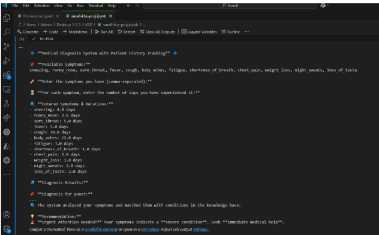

# 🩺 Medical Diagnosis Knowledge-Based System (KBS)

A rule-based system that mimics expert medical decision-making by using symptoms, probabilities, and patient history to deliver reliable, intelligent diagnoses.

---

## 👤 Author  
**Yanet Niguse Tesfay**  
📅 **Date:** 7 Feb 2025

---

## 🧠 Project Overview

This project is a **Knowledge-Based System (KBS)** designed to simulate a medical expert’s reasoning process. It diagnoses diseases based on input symptoms, analyzes severity, and uses historical data to enhance prediction accuracy.

---

## ✅ Core Features

- 🔍 **Symptom-Based Diagnosis**  
  Users input symptoms and duration to receive potential diagnoses.

- 📊 **Probability Adjustments**  
  Calculates disease likelihood, adjusting for repeated conditions in the past.

- 🩺 **Severity Analysis**  
  Classifies cases as *Mild*, *Moderate*, or *Severe* based on symptom count and impact.

- ⏳ **Temporal Reasoning**  
  Tracks how long symptoms have been present to evaluate progression.

- 📁 **Patient History Tracking**  
  Stores all previous diagnoses in a persistent file: `patient_history.json`.

---


## 📸 Screenshots
- 💡 *System Running*: Example of user inputs and diagnosis output  
- 📂 *Patient History File*: JSON showing past diagnoses and visit records  
- 🧪 *Code Execution*: Demo of the script running in a Python IDE

### 🧪 Code Execution in IDE



---

## 📂 How to Run

```bash
# Clone the repository
git clone https://github.com/yanetniguse/medical_diagnosis_kbs.git

# Navigate into the folder
cd medical_diagnosis_kbs

# Run the script
python diagnosis.py
```

---

## 🛠 Technologies Used

- **Python**  
- **JSON** (for patient data persistence)  
- **Rule-Based Logic**

---

## 🚀 Possible Future Enhancements

- 🧠 Machine Learning integration for more adaptive diagnosis  
- 🖼 GUI interface (e.g., using Tkinter or Flask)  
- 🌍 Expand the medical knowledge base with verified datasets

---

## 📌 Disclaimer

This system is built for **academic and demonstration purposes** only.  
⚠️ It is **not** intended for real-world medical use without verification by certified healthcare professionals.
